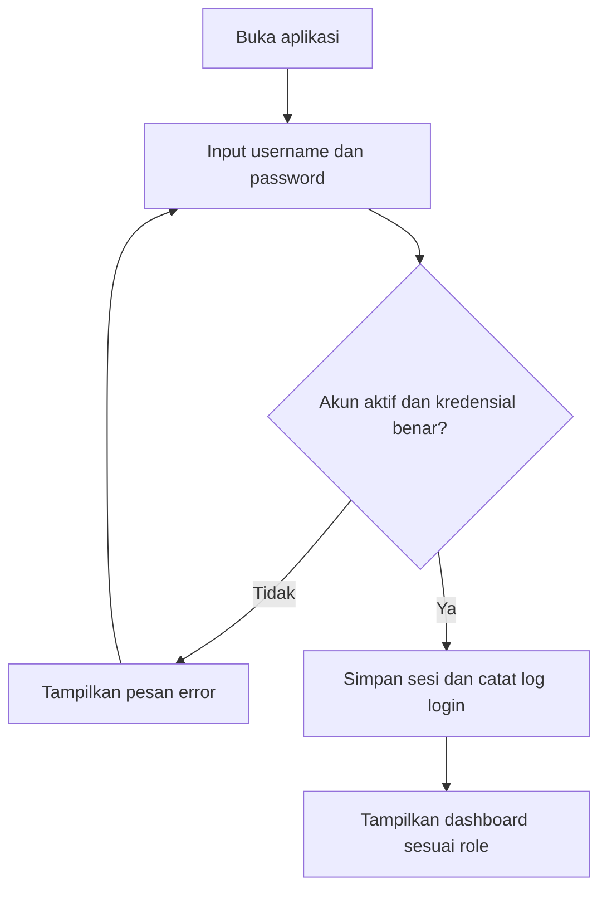
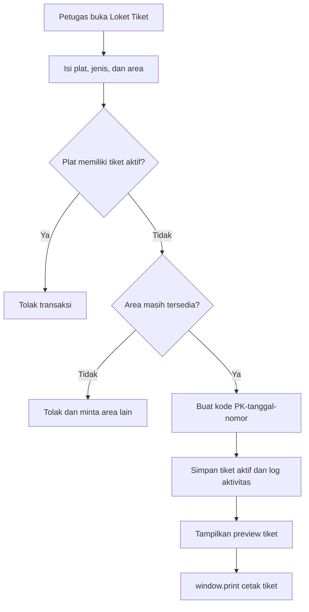
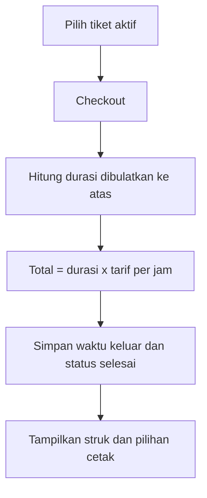

# Alur proses utama

## Login

```mermaid
flowchart TD
    A[Buka aplikasi] --> B[Input username dan password]
    B --> C{Akun aktif dan kredensial benar?}
    C -- Tidak --> D[Tampilkan pesan error]
    D --> B
    C -- Ya --> E[Simpan sesi dan catat log login]
    E --> F[Tampilkan dashboard sesuai role]
```

## Transaksi loket dan cetak tiket

```mermaid
flowchart TD
    A[Petugas buka Loket Tiket] --> B[Isi plat, jenis, dan area]
    B --> C{Plat memiliki tiket aktif?}
    C -- Ya --> D[Tolak transaksi]
    C -- Tidak --> E{Area masih tersedia?}
    E -- Tidak --> F[Tolak dan minta area lain]
    E -- Ya --> G[Buat kode PK-tanggal-nomor]
    G --> H[Simpan tiket aktif dan log aktivitas]
    H --> I[Tampilkan preview tiket]
    I --> J[window.print cetak tiket]
```

## Checkout dan cetak struk

```mermaid
flowchart TD
    A[Pilih tiket aktif] --> B[Checkout]
    B --> C[Hitung durasi dibulatkan ke atas]
    C --> D[Total = durasi x tarif per jam]
    D --> E[Simpan waktu keluar dan status selesai]
    E --> F[Tampilkan struk dan pilihan cetak]
```
